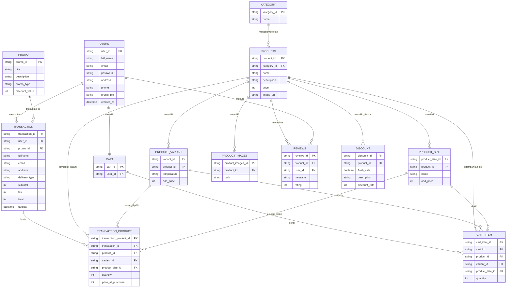

# ERD DIAGRAM COFFE SHOP

```mermaid
erDiagram

    USERS {
        string user_id PK
        string full_name
        string email
        string password
        string address
        string phone
        string profile_pic
        datetime created_at
    }

    PRODUCTS {
      string product_id PK
      string kategory_id FK
      string name
      string description
      int price
      string image_url
    }

    KATEGORY {
      string kategory_id PK
      string name
    }


    PROMO {
      string promo_id PK
      string title
      string description
      string promo_type
      int discount_value
    }

    CART {
      string cart_id PK
      string user_id FK
    }

    CART_ITEM {
    string cart_item_id PK
    string cart_id FK
    string product_id FK
    string variant_id FK
    string product_size_id FK
    int quantity
    }

    PRODUCT_VARIANT{
      string variant_id PK
      string product_id FK
      string temperature
      int add_price
    }

    PRODUCT_SIZE{
      string product_size_id PK
      string product_id FK
      string name
      int add_price
    }

    TRANSACTION {
      string transaction_id PK
      string user_id FK
      string promo_id FK
      string fullname
      string email
      string address
      string delivery_type
      int subtotal
      int tax
      int total
      datetime tanggal
    }

    TRANSACTION_PRODUCT {
      string transaction_product_id PK
      string transaction_id FK
      string product_id FK
      string variant_id FK
      string product_size_id FK
      int quantity
      int price_at_purchase
    }

    PRODUCT_IMAGES{
      string product_images_id PK
      string product_id FK
      string path
    }

    REVIEWS{
     string reviews_id PK
     string product_id FK
     string user_id FK
     string message
     int rating
    }

    DISCOUNT{
      string discount_id PK
      string product_id FK
      boolean flash_sale
      string description
      int discount_rate
    }

    USERS ||--|| CART : memiliki
    CART ||--o{ CART_ITEM : berisi
    PRODUCTS ||--o{ CART_ITEM : ditambahkan_ke
    PRODUCT_VARIANT ||--o{ CART_ITEM : dipilih
    PRODUCT_SIZE ||--o{ CART_ITEM : dipilih

    KATEGORY ||--o{ PRODUCTS : mengelompokkan
    PRODUCTS ||--o{ PRODUCT_VARIANT : memiliki
    PRODUCTS ||--o{ PRODUCT_SIZE : memiliki
    PRODUCTS ||--o{ PRODUCT_IMAGES : memiliki
    PRODUCTS ||--o{ REVIEWS : menerima
    PRODUCTS ||--o{ DISCOUNT : memiliki_diskon
    USERS ||--o{ REVIEWS : menulis

    USERS ||--o{ TRANSACTION : melakukan
    TRANSACTION ||--o{ TRANSACTION_PRODUCT : berisi
    PRODUCTS ||--o{ TRANSACTION_PRODUCT : termasuk_dalam
    PRODUCT_VARIANT ||--o{ TRANSACTION_PRODUCT : varian_dipilih
    PRODUCT_SIZE ||--o{ TRANSACTION_PRODUCT : ukuran_dipilih
    PROMO ||--o{ TRANSACTION : diterapkan_di


```